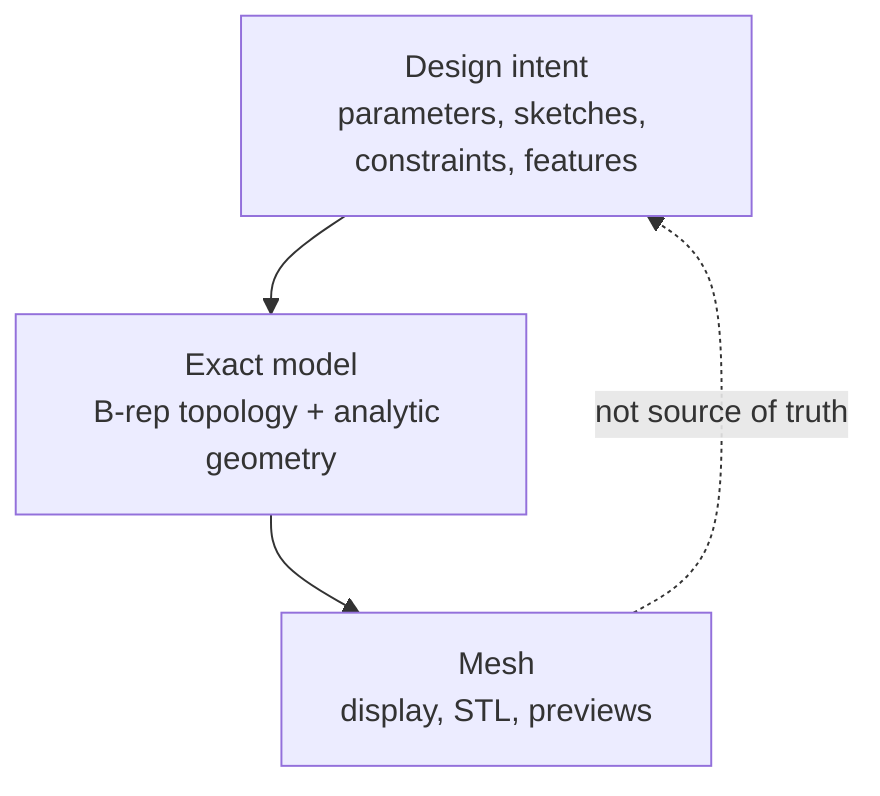
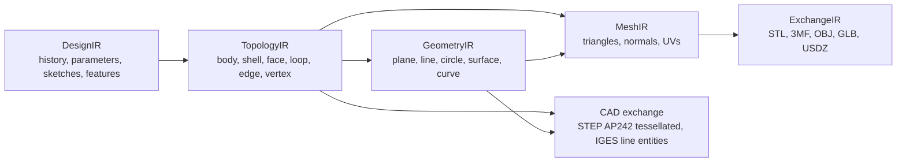
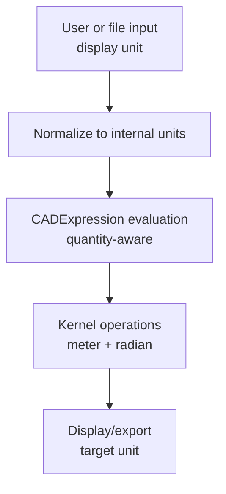
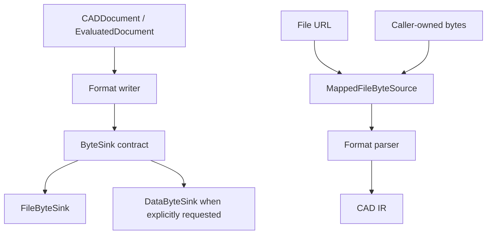
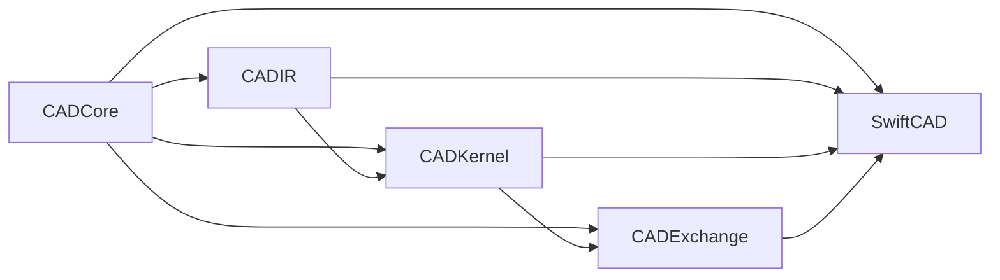
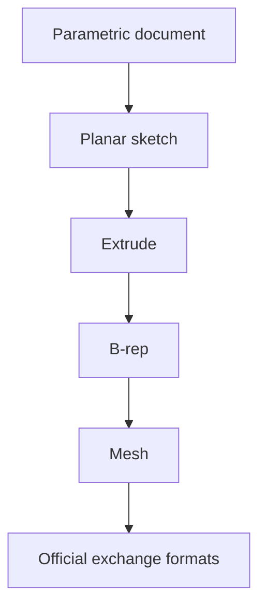

# Swift-CAD Philosophy

## Purpose

Swift-CAD is a native Swift CAD foundation for parametric modeling, exact geometric representation, deterministic evaluation, and exchange with external CAD and 3D formats.

The project should be useful in three roles:

| Role | Responsibility |
|---|---|
| Library | Provide stable Swift APIs for building, loading, evaluating, and exporting CAD documents. |
| Kernel foundation | Define exact geometry, topology, parameters, tolerance, and feature evaluation boundaries. |
| Exchange boundary | Convert native CAD state to official formats such as STEP, IGES, STL, 3MF, OBJ, DXF, SVG, GLB, USD, USDZ, and PDF without letting those formats define the internal model. |

The project is not a mesh editor. Meshes are important for display and fabrication export, but they are derived data.

## Core Belief

CAD state must be represented as design intent plus exact geometry, not as triangles.

The source of truth is:

| Layer | Status | Reason |
|---|---:|---|
| Parameters | Source | They define reusable design values and dimensional intent. |
| Design graph | Source | It records feature order, dependencies, suppression, and regeneration intent. |
| Sketch constraints | Source | They preserve editable 2D design intent. |
| B-rep topology | Evaluated source for exact shape | It represents the exact body after feature evaluation. |
| Mesh | Derived | It is an approximation created from B-rep for rendering or exchange. |
| Export files | Derived | They are projections into another ecosystem. |

## Architectural Principles

### 1. Separate Intent, Topology, Geometry, and Display

Swift-CAD uses multiple intermediate representations because one representation cannot safely serve all CAD responsibilities.

| Representation | Owns | Must not own |
|---|---|---|
| DesignIR | Parametric history and dependencies | Triangle data or external file layout |
| GeometryIR | Mathematical curves and surfaces | Face trimming ownership or feature history |
| TopologyIR | B-rep connectivity and orientation | Mathematical definitions duplicated from GeometryIR |
| MeshIR | Approximate triangle data | Editable CAD truth |
| ExchangeIR | Import/export mapping | Core modeling invariants |

The most important separation is between GeometryIR and TopologyIR. A cylindrical surface and a face trimmed from that surface are different objects.

### 2. Make Source Data Explicit

Every persisted value must answer a simple question: is this source data or cache data?

| Data | Default persistence | Validation requirement |
|---|---|---|
| `CADDocument` | Persist | Must include schema version and unit system. |
| `DesignGraph` | Persist | Feature dependencies must be valid. |
| `ParameterTable` | Persist | Table keys, parameter IDs, names, and expressions must resolve with unit consistency and finite source values. |
| `BRepModel` | Runtime cache in current support | Must declare source revisions and source fingerprint, and validate topology, curve, trim, and vertex consistency. |
| `Mesh` | Runtime cache in current support | Must declare source revisions, source fingerprint, kernel version, tolerance, tessellation options, and match regenerated tessellation. |
| Export output | Do not re-import as native truth by default | Import must go through an explicit exchange pipeline. |

Derived caches belong to evaluated documents, not to `CADDocument`. Native persistence currently stores source data only; native loading rejects unsupported cache fields and unsupported nested source fields instead of silently discarding them. Any persisted cache mode must validate source fingerprint, metadata, and regenerated content freshness before use. Source fingerprints and native package bytes must be canonical over semantic source content and independent of dictionary insertion order.

### 3. Treat Units as a Type System

CAD dimensions are not plain numbers. A number has meaning only with quantity kind and unit interpretation.

Rules:

| Topic | Decision |
|---|---|
| Internal length | Meter |
| Internal angle | Radian |
| Display length | Document-defined unit, such as millimeter or inch |
| Display angle | Document-defined unit, such as degree |
| CADExpression constants | Must carry quantity kind or be dimensionless scalar |
| Parameter and variable names | Must be stable lookup identifiers, separate from display labels |
| Quantity values | Must be finite after conversion and evaluation |
| Invalid unit operations | Must fail with typed errors |

An expression resolver must reject invalid dimensional operations and unbound variables instead of silently returning a `Double`.

### 4. Tolerance Is Part of the Model

Exact CAD still operates with finite numerical tolerance. Tolerance must be explicit and passed through evaluation.

| Tolerance | Meaning |
|---|---|
| Distance tolerance | Minimum meaningful geometric distance in internal length units. |
| Angle tolerance | Minimum meaningful angular difference in radians. |
| Tessellation linear tolerance | Maximum allowed chordal deviation for mesh generation. |
| Tessellation angular tolerance | Maximum allowed normal or segment angle deviation. |

Tolerance must not be hidden in global state. Kernel algorithms should receive `ModelingTolerance` or a context that owns it.
Default pipeline dependencies are part of that contract: constructing an evaluator with a custom tolerance must carry that
tolerance through source validation, source fingerprinting, profile extraction, feature evaluation, tessellation, mesh validation,
evaluated-document validation, and cache validation.
Area-like quantities must be compared against squared distance tolerance.

### 5. Bytes Are a Boundary, Not the Model

Export bytes are a boundary effect. They must be streamed to an explicit destination instead of becoming the default in-memory representation of a model.

| Principle | Consequence |
|---|---|
| The official export API is sink-based. | Public exporters write to `ByteSink` and do not return whole-file `Data`. |
| In-memory collection is explicit. | Tests and callers that need bytes use `DataByteSink` knowingly. |
| File output is atomic and direct. | URL export writes to a temporary `FileByteSink` and replaces the destination after success. |
| Input is borrowed. | Import and native load APIs receive `ByteSource`, making ownership and lifetime explicit at the boundary. |
| File input is mapped or rejected. | URL import uses `MappedFileByteSource`; unsupported platforms fail explicitly instead of copying the whole file. |
| Package entries are lifetime-scoped. | Stored ZIP entry payloads are consumed inside `withEntries` so they cannot outlive the source mapping. |
| Format serialization may allocate metadata, not whole outputs. | Small headers, JSON fragments, and central-directory metadata are acceptable; full output buffers are not the design center. |

Zero-copy is a design constraint, not a later optimization pass. When a format requires computed offsets, central-directory records, XML parsing, or JSON decoding, the implementation may retain the minimal semantic metadata needed to build CAD IR, but file transport bytes should remain borrowed or streamed. A whole-file copy is a bug unless it is an explicit caller-selected in-memory adapter.

### 6. Stable Identity Matters More Than UUID Convenience

UUIDs are useful for object identity inside a document, but CAD needs stable shape identity across regeneration.

| Identity | Purpose |
|---|---|
| `TaggedID<Tag>` | Type-safe in-memory and persisted object identity. |
| `PersistentName` | Regeneration-stable reference to generated topology with non-empty components, non-empty text tokens, and non-negative indices. |
| `TopologyReference` | Runtime reference to evaluated shape objects. |
| `PersistentNameMap` | Cache-stored bridge from generated names to topology references. |
| External reference | Explicit link to files or documents outside the current document. |

Persistent naming is mandatory for generated topology. Evaluation must reject collisions, evaluated documents must cover every generated body, face, edge, and vertex with stable names, and B-rep caches must carry the same map used by the top-level evaluated document.

### 7. Public API Should Hide Internal Tables

Internal IR should be normalized and explicit. Public API should be ergonomic and intention-revealing.

| Layer | Style |
|---|---|
| Public facade | Builder-style APIs, clear modeling operations, typed errors. |
| IR modules | Codable, Sendable, normalized tables, stable schema. |
| Kernel modules | Protocol-oriented evaluators and deterministic outputs. |
| Exchange modules | Explicit import/export configuration and diagnostics. |

Users should not be forced to manually create every low-level face, edge, and vertex for common operations.

### 8. Keep Modules Directional

Dependencies should form a one-way graph.

| Module | Allowed dependencies | Responsibility |
|---|---|---|
| `CADCore` | None | IDs, units, math primitives, schema, errors, tolerance. |
| `CADIR` | `CADCore` | Document, design graph, sketch, geometry, topology, mesh IR. |
| `CADKernel` | `CADCore`, `CADIR` | Resolution, sketch processing, feature evaluation, tessellation. |
| `CADExchange` | `CADCore`, `CADIR`, `CADKernel` | Native save/load, STL, DXF, official exchange formats. |
| `SwiftCAD` | All internal modules | Public facade. |

No lower-level module should import the public facade.

### 9. Prefer Protocol-Oriented Boundaries

Public service boundaries should be protocols, and implementations should be replaceable.

| Boundary | Protocol role |
|---|---|
| Parameter resolution | Resolve parameter expressions into typed quantities. |
| Sketch solving | Convert sketch constraints into resolved sketch geometry. |
| Profile extraction | Convert sketch entities into closed planar profiles. |
| Feature evaluation | Apply feature nodes to an evaluation context. |
| Tessellation | Convert B-rep bodies to mesh with options while preserving shell and face orientation. |
| Export | Convert native or derived data to external format bytes. |

Protocols should be small and specific. A single all-powerful kernel protocol should be avoided.

### 10. Concurrency Must Preserve Determinism

CAD evaluation should be deterministic for the same document, schema version, and kernel settings.

| State kind | Preferred concurrency tool |
|---|---|
| Short, synchronous, memory-only cache | `Mutex` |
| Ordered asynchronous evaluation with suspension | `actor` |
| Pure value IR | `Sendable` structs and enums |

Evaluation should avoid hidden global mutable state. If parallel evaluation is introduced, dependency order and cache invalidation must remain explicit.

### 11. Errors Are Product Surface

Modeling failures are expected in CAD. Errors must be structured and actionable.

| Error category | User-facing meaning |
|---|---|
| Schema error | File cannot be read as this version or cannot migrate. |
| Unit error | CADExpression combines incompatible quantities. |
| Constraint error | Sketch constraints are underdefined, overdefined, or inconsistent. |
| Topology error | Generated B-rep violates connectivity or orientation invariants. |
| Feature failure | A feature failed and downstream dependent features are blocked or invalidated. |
| Evaluation error | A feature, final B-rep, tessellation, cache, or other evaluation stage cannot complete with its current inputs. |
| Export error | External format cannot represent the requested data. |

Errors must not be swallowed. Optional failure is acceptable only when the absence of a value is part of the domain model.
Diagnostic evaluation must preserve a document-level failure whenever no evaluated document is produced, even when every feature reached `evaluated` before finalization failed.

## Official Support Discipline

Swift-CAD treats the current modeling pipeline and the official exchange matrix as supported product surface.

Official support means the format has an implemented API, typed failure behavior, and tests that exercise the declared direction. When a standard format has multiple valid representations, Swift-CAD documents the exact profile it writes and reads.

| Category | Formats | Import | Export | Contract |
|---|---|---:|---:|---|
| Native | `.swcad` | Yes | Yes | Source document package. |
| CAD Exchange | `.step`, `.stp` | Yes | Yes | AP242 tessellated shape representation. |
| CAD Exchange | `.iges`, `.igs` | Yes | Yes | Type 110 line-entity triangle wire profile. |
| Mesh and 3D Print | `.stl`, `.3mf`, `.obj` | Yes | Yes | Triangle mesh exchange. |
| 2D Exchange | `.dxf`, `.svg` | Yes | Yes | Projected 2D polygon or 3DFACE exchange. |
| Visualization and AR | `.glb`, `.usd`, `.usda`, `.usdc`, `.usdz` | No | Yes | GLB binary glTF, USDA text, USDC via `usdcat`, USDZ via `usdzip`. |
| Document Output | `.pdf` | No | Yes | Review PDF generated from mesh summary. |

Formats outside this matrix are not part of the official support target.

## Schema and Compatibility Philosophy

Native file compatibility is a product promise. The persisted format should not be an accidental mirror of Swift enum layout.

| Principle | Requirement |
|---|---|
| Explicit schema | Every native file includes `schemaVersion`. |
| Stable union tags | Persisted polymorphic values use stable discriminators. |
| Migrations | Supported old versions migrate through explicit migration steps. |
| Cache invalidation | Derived data includes non-negative, advanceable source revision and an insertion-order-independent source fingerprint, then exposes metadata plus content freshness validation under the evaluator's modeling tolerance. Body-producing evaluated documents require populated B-rep and mesh caches; evaluated documents must revalidate source, top-level B-rep, B-rep cache, mesh, mesh cache alignment, and source re-evaluation geometry content before export. |
| Canonical persistence | Source-equivalent native documents produce stable package bytes independent of Swift dictionary insertion or hash-table order. |
| Forward safety | Unknown required fields fail clearly. |
| Optional extension | Optional extension data may be ignored only when it is marked safe to ignore. |

Swift `Codable` can be used for implementation, but the wire format must be intentionally designed.

## Exchange Philosophy

External formats are boundaries, not architectural centers.

| Format | Role |
|---|---|
| `.swcad` | Native source and optional cache container. |
| STEP / IGES | CAD exchange boundary using documented tessellated and line-entity profiles; STEP parser structure and units are derived from complete exchange envelopes, a supported AP242 tessellated DATA entity set, referenced tessellated point lists, balanced DATA-section reference lists outside quoted strings, and verified conversion factors for conversion-based length units. Missing numeric fields, malformed conversion factors, unsupported DATA entities, and unsupported referenced STEP length units fail explicitly. IGES structure is derived from a complete fixed-width record table with non-empty S/G/D/P sections and matched Terminate counts before units or line entities are parsed, and IGES units are derived from the Global section without fallback. |
| STL / 3MF / OBJ | Mesh and 3D print exchange; STL and OBJ unit metadata use explicit single Swift-CAD profile locations, OBJ import accepts only the declared triangular mesh profile, and 3MF package entries plus OPC package metadata must be the complete supported profile while model metadata, geometry, and core attributes are scoped to supported package paths, the 3MF core-namespace model root, official container paths, and build-referenced resources. |
| DXF / SVG | 2D and projected drawing exchange; DXF units are scoped to one HEADER declaration, DXF geometry is scoped to ENTITIES sections, unsupported DXF sections and unsupported section-external records fail instead of being ignored, and truncated or trailing DXF streams fail at EOF validation. SVG metadata is scoped to the SVG-namespace svg root. SVG import accepts only explicit polygon geometry, supported attributes, whitespace-only character data, and well-formed point-list separators in supported root or group containers; nested svg containers fail explicitly, and unsupported SVG geometry, attributes, or visible character payloads fail rather than being partially imported. |
| GLB / USD / USDZ | Visualization and AR export, with USDC/USDZ verified by bounded system USD toolchain execution and post-conversion signatures. |
| PDF | Review and document output. |

Imports from mesh formats should not be treated as native parametric documents unless a reconstruction pipeline explicitly creates design intent.

## Testing Philosophy

Tests should protect invariants rather than only checking happy paths.

| Area | Required checks |
|---|---|
| IDs | Type-safe IDs do not cross domains accidentally. |
| Units | Invalid dimensional expressions fail. |
| Parameters | Table key identity, valid lookup names, dependency order, cycles, unresolved references, and unbound variables are detected. |
| Sketch | Structural sketch validation verifies constraint and dimension references, constraints and dimensions derive a solver-ready graph, document-level expression validation resolves sketch quantities to finite required kinds, radius and diameter quantities are positive, closed convex profile extraction succeeds, clockwise loops normalize to plane-positive orientation, and unsupported profiles fail clearly. |
| Feature graph | Operation-specific input and output contracts are validated with typed ports and dependency edges; active features cannot depend on suppressed source features; extrude distances resolve to positive finite lengths; custom extrude directions create solid volume rather than tangent sweeps. |
| Topology | Faces, face surfaces, loop roles, ownership references, shell-local edge and vertex ownership, explicit curve/surface parameter domains, edge trims interpreted in their referenced curve parameter space, curve geometry, edges, vertices, vertex-identity loop closure, non-degenerate line-only face area, non-zero line-only shell volume, and half-edge orientation references are consistent. |
| Geometry | Points, directions, normals, radii, matrices, transforms, and stored geometry references are finite and normalized where required. |
| Tessellation | Evaluation returns at least one body mesh; mesh indices are valid, every stored mesh position is referenced by triangle topology, degenerate triangles are rejected, and normals are deterministic, unit-length, and aligned with triangle winding. |
| Export | Every official export format writes parseable non-empty data with expected signature, and coordinate values remain finite after target-unit conversion before being written; USD outputs must pass conversion postconditions and load in `usdchecker`. |
| Import | Every official import format returns a document or validated mesh data, and container references are resolved explicitly instead of being inferred or ignored. |
| Native format | Save/load round trips source-only documents with canonical package bytes; unsupported package entries, unreferenced ZIP local entries, ZIP optional metadata, duplicate JSON object keys, duplicate logical keys or unknown fields inside object-map and key/value-array encoded source dictionaries, unknown or inactive union payload keys, and runtime caches remain outside native source truth and fail instead of being ignored. |

Swift tests must run with a timeout. Shared resources must be guarded because Swift Testing runs tests in parallel by default.

## Decision Checklist

Use this checklist before adding a new type, module, or public API.

| Question | Expected answer |
|---|---|
| Is this source data or derived data? | The type name or storage location makes it clear. |
| Which module owns it? | Ownership follows the dependency graph. |
| Does it need stable identity? | Use `TaggedID` and, when generated topology is involved, `PersistentName`. |
| Does it contain dimensions? | Use unit-aware quantities and typed expression resolution. |
| Can it fail? | Expose typed errors. |
| Is it persisted? | Define stable schema and migration behavior. |
| Is it public API? | Keep the surface narrow and implemented. |
| Is it outside official support? | Keep it out of the public support matrix. |

## Summary

Swift-CAD should be built around a small set of strict ideas:

| Idea | Consequence |
|---|---|
| Design intent is source truth | `DesignGraph` and parameters are first-class. |
| Exact geometry comes before mesh | B-rep and analytic geometry drive tessellation, not the reverse. |
| Units and tolerance are explicit | Kernel results are predictable and debuggable. |
| Identity must survive regeneration | Persistent naming is part of the architecture. |
| Public API stays smaller than internal IR | Users get ergonomics without weakening the model. |
| Official support is tested support | A format is listed only when implemented and covered by tests. |
