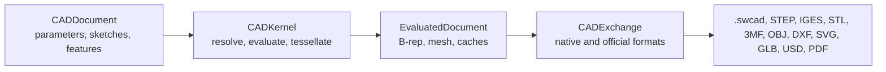
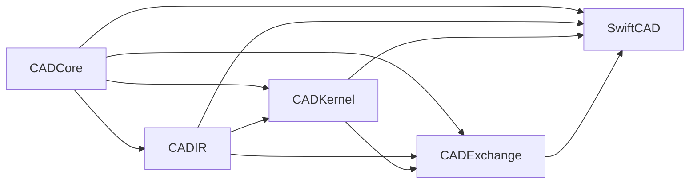
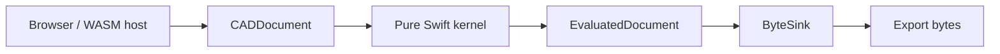
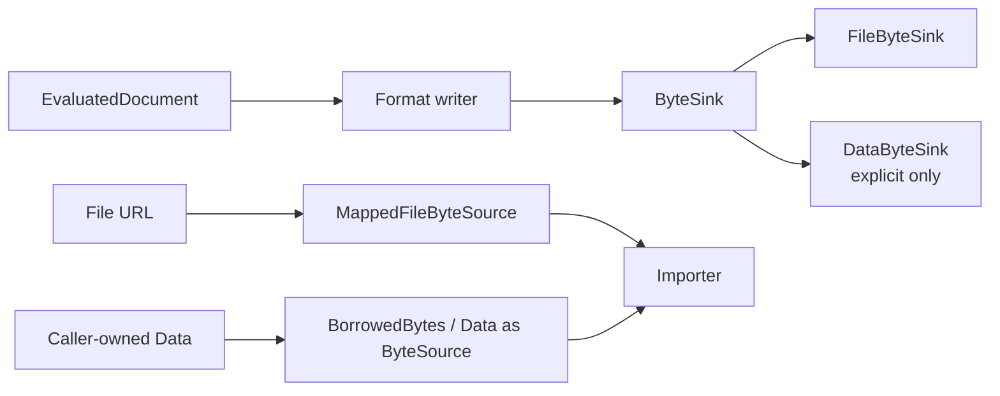

# Swift-CAD

[](https://github.com/1amageek/swift-CAD/actions/workflows/ci.yml)

Swift-CAD is a native Swift foundation for parametric CAD documents, deterministic evaluation, exact B-rep topology, mesh tessellation, WebAssembly deployment, and exchange with common CAD, mesh, visualization, and document formats.

The project treats triangles as derived data. The editable source of truth is the document source: parameters, sketches, constraints, feature history, units, and design graph.



## Status

Swift-CAD currently supports the official rectangle-extrude modeling pipeline and the official import/export matrix defined in [SPEC.md](SPEC.md). The implementation is covered by focused unit tests, exchange tests, facade end-to-end tests, WebAssembly build verification, and Xcode test execution.

| Area | Current support |
|---|---|
| Public facade | `SwiftCAD` builder, evaluation, native save/load, official exchange write/import |
| Native document | `.swcad` source-only ZIP package |
| Modeling | Parameters, sketches, rectangle profiles, extrude features |
| Exact shape | Planar B-rep bodies with topology and analytic geometry |
| Derived shape | Deterministic triangle meshes |
| Exchange | Native, STEP, IGES, STL, 3MF, OBJ, DXF, SVG, GLB, USD, USDA, USDC, USDZ, PDF |
| Byte boundary | Sink-based export and borrowed/mapped import |
| WebAssembly | Important supported build target for portable CAD kernels and browser-hosted workflows |

## Package Layout



| Target | Responsibility | Product |
|---|---|---:|
| `CADCore` | IDs, units, quantities, math primitives, schema, errors, tolerance | No |
| `CADIR` | Document, design graph, sketch IR, geometry IR, topology IR, mesh IR | Yes |
| `CADKernel` | Parameter resolution, profile extraction, feature evaluation, tessellation | Yes |
| `CADExchange` | Native package, byte IO, official import/export formats | Yes |
| `SwiftCAD` | Public facade over the lower-level modules | Yes |

## Requirements

| Requirement | Value |
|---|---|
| Swift tools version | Swift 6.3 or later |
| Supported platforms | macOS 14+, iOS 17+, visionOS 1+ |
| Package manager | Swift Package Manager |
| WASM build | Swift 6.3.1 toolchain with `swift-6.3.1-RELEASE_wasm` SDK |
| Optional USD conversion | System USD toolchain for USDC/USDZ conversion paths |

## WebAssembly Support

WebAssembly support is an important project goal. Swift-CAD keeps the CAD kernel, IR, validation, and exchange byte boundaries suitable for portable execution where possible.



| WASM concern | Project decision |
|---|---|
| Core modeling | Keep `CADCore`, `CADIR`, and `CADKernel` portable Swift code. |
| Byte output | Use `ByteSink` so browser hosts can stream or collect output explicitly. |
| Byte input | Use `ByteSource`; file mapping is platform-specific and fails explicitly where unavailable. |
| System tools | USD binary/container conversion depends on host toolchains and is not assumed inside WASM. |
| Verification | Build with `swift build --swift-sdk swift-6.3.1-RELEASE_wasm`. |
| Design constraint | Avoid APIs that require whole-file transport buffers as the default path. |

## Installation

Add Swift-CAD as a Swift Package dependency:

```swift
dependencies: [
    .package(url: "https://github.com/1amageek/swift-CAD.git", branch: "main")
]
```

Then depend on the facade product:

```swift
.target(
    name: "YourTarget",
    dependencies: [
        .product(name: "SwiftCAD", package: "swift-CAD")
    ]
)
```

## Quick Start

Create a parameterized box, evaluate it, save the native document, and write a binary STL.

```swift
import Foundation
import SwiftCAD

let document = try CADDocument.millimeters(named: "Box") { cad in
    let width = cad.lengthParameter(named: "width", 40.0)
    let height = cad.lengthParameter(named: "height", 20.0)
    let depth = cad.lengthParameter(named: "depth", 10.0)

    let profile = try cad.sketch(on: .xy, named: "Base sketch") { sketch in
        sketch.rectangle(width: .parameter(width), height: .parameter(height))
    }

    cad.extrude(profile, distance: depth, named: "Extrude")
}

let pipeline = CADPipeline()
let evaluated = try pipeline.evaluate(document)

try pipeline.save(document, to: URL(fileURLWithPath: "box.swcad"))

let stlSink = try FileByteSink(url: URL(fileURLWithPath: "box.stl"))
try pipeline.write(evaluated, as: .stl, to: stlSink)
try stlSink.close()
```

Import a supported exchange file through a borrowed or mapped byte source:

```swift
import Foundation
import SwiftCAD

let source = try MappedFileByteSource(url: URL(fileURLWithPath: "box.stl"))
let imported = try CADPipeline().importExchange(source, as: .stl)

for mesh in imported.meshes.values {
    try mesh.validate()
}
```

## Official Formats

| Category | Format | Extensions | Import | Export |
|---|---|---|---:|---:|
| Native | Swift-CAD Native | `.swcad` | Yes | Yes |
| CAD exchange | STEP | `.step`, `.stp` | Yes | Yes |
| CAD exchange | IGES | `.iges`, `.igs` | Yes | Yes |
| Mesh / print | STL | `.stl` | Yes | Yes |
| Mesh / print | 3MF | `.3mf` | Yes | Yes |
| Mesh / DCC | OBJ | `.obj` | Yes | Yes |
| Drawing | DXF | `.dxf` | Yes | Yes |
| Drawing | SVG | `.svg` | Yes | Yes |
| Visualization | GLB | `.glb` | No | Yes |
| Visualization / AR | USD | `.usd`, `.usda`, `.usdc` | No | Yes |
| Visualization / AR | USDZ | `.usdz` | No | Yes |
| Document | PDF | `.pdf` | No | Yes |

Unsupported import directions throw `ImportError.unsupportedFormat`.

## Zero-Copy Byte Boundary

Swift-CAD's official byte APIs are streaming or borrowed APIs. Export writes to `ByteSink`; import reads from `ByteSource`.



| Boundary | Contract |
|---|---|
| Export | Public writers stream to `ByteSink` and do not require whole-file output buffers. |
| File output | URL export/save uses atomic temporary file writes and replaces the destination after success. |
| Import | Importers borrow bytes through `ByteSource`. |
| File input | File import/load uses `MappedFileByteSource` on supported platforms. |
| In-memory bytes | `DataByteSink` and `BorrowedBytes` are explicit adapters for tests, diagnostics, or caller-owned data. |
| ZIP packages | Stored package entries are lifetime-scoped views over source bytes. |

## Validation and Error Handling

All fallible public operations throw typed errors. The implementation rejects unsupported or ambiguous data instead of silently accepting partial state.

| Error type | Typical cause |
|---|---|
| `SchemaError` | Unsupported schema, invalid native package, invalid metadata |
| `UnitError` | Incompatible quantities, invalid unit values |
| `ParameterError` | Duplicate names, unknown references, invalid parameter table |
| `SketchError` | Invalid sketch references, unsupported or open profiles |
| `FeatureEvaluationError` | Invalid feature graph, unsupported operation, empty result |
| `CacheValidationError` | Stale B-rep or mesh caches |
| `TopologyError` | Invalid B-rep references, loops, trims, shells, or ownership |
| `TessellationError` | Invalid tessellation input |
| `ExportError` | Invalid mesh, unsupported output, file write failure |
| `ImportError` | Unsupported format, malformed imported data, file read failure |

Production code should preserve error meaning with `throws` or `do`/`catch`.

## Testing

Run focused SwiftPM tests with a command-level timeout:

```bash
perl -e 'alarm 180; exec @ARGV' swift test --no-parallel
```

Run the facade end-to-end tests:

```bash
perl -e 'alarm 120; exec @ARGV' swift test --no-parallel --filter SwiftCADTests
```

Run the WebAssembly build when the configured SDK is installed:

```bash
swift build --swift-sdk swift-6.3.1-RELEASE_wasm
```

Run the Xcode test runner:

```bash
perl -e 'alarm 240; exec @ARGV' xcodebuild test -scheme SwiftCAD-Package -destination 'platform=macOS'
```

The current test suite covers:

| Suite | Scope |
|---|---|
| `CADCoreTests` | IDs, units, expressions, matrices, quantities, tolerance |
| `CADIRTests` | Document, graph, sketch, geometry, topology, mesh validation |
| `CADKernelTests` | Parameter resolution, profile extraction, B-rep evaluation, tessellation, cache freshness |
| `CADExchangeTests` | Native package, official format matrix, malformed imports, zero-copy IO, atomic writes |
| `SwiftCADTests` | Public facade workflows and facade-level edge cases |

## Documentation

| Document | Purpose |
|---|---|
| [PHILOSOLY.md](PHILOSOLY.md) | Design philosophy, source-of-truth model, architectural principles |
| [SPEC.md](SPEC.md) | Official support scope, file formats, validation rules, acceptance criteria |

## Project Principles

| Principle | Meaning |
|---|---|
| Design intent first | Parameters, sketches, constraints, and feature history define editable CAD truth. |
| Exact geometry before mesh | B-rep and analytic geometry are evaluated before tessellation. |
| Units are typed | Length, angle, and scalar quantities are not interchangeable raw doubles. |
| Caches are derived | Runtime B-rep and mesh caches must prove freshness before export. |
| Byte transport is explicit | File IO uses `ByteSource` and `ByteSink`; whole-file buffers are opt-in adapters. |
| Fail closed | Unsupported records, malformed payloads, and ambiguous metadata throw typed errors. |

## License

Swift-CAD is released under the MIT License. See [LICENSE](LICENSE).
