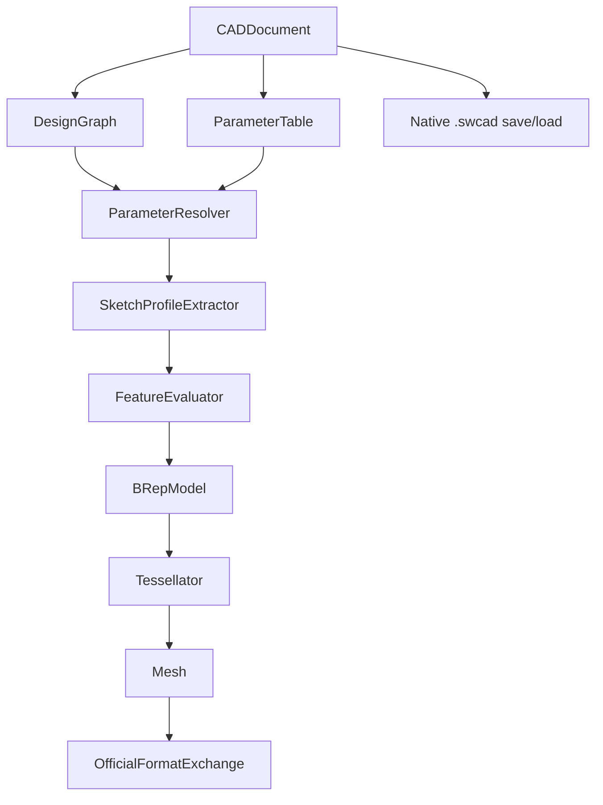
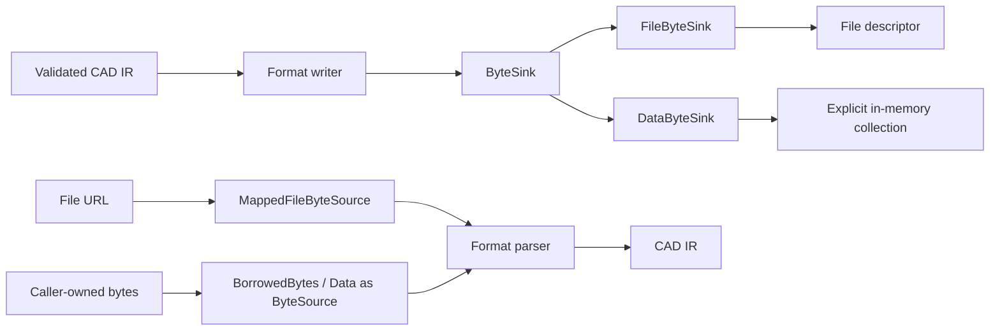
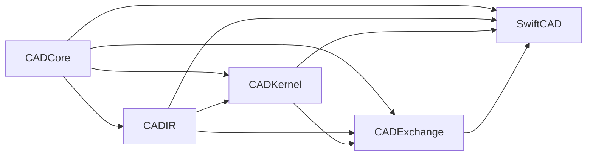
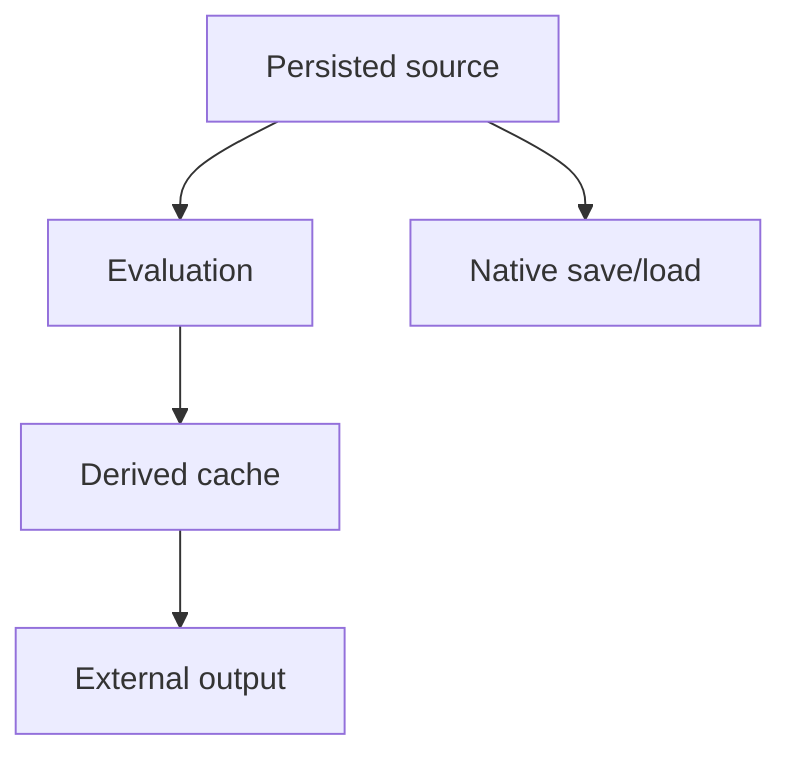
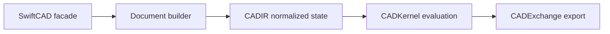
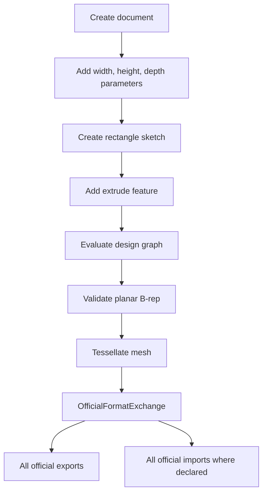

# Swift-CAD Specification

## Status

This document defines the official support specification for Swift-CAD.

This document is the technical specification for the supported implementation.

| Field | Value |
|---|---|
| Project | Swift-CAD |
| Package name | `SwiftCAD` |
| Native extension | `.swcad` |
| Initial platform target | Swift Package, Swift 6.3 or later |
| Official support goal | Build parametric documents and import/export the official file format matrix. |

## System Overview



Swift-CAD implements one complete modeling and exchange pipeline:

| Stage | Input | Output |
|---|---|---|
| Parameter resolution | `ParameterTable` | `ResolvedParameterTable` |
| Sketch profile extraction | `Sketch` | closed planar profiles |
| Feature evaluation | `FeatureNode` + context | `BRepModel` |
| Tessellation | `BRepModel` + options | `Mesh` |
| Export | `EvaluatedDocument` | official format bytes |
| Native persistence | source-only `CADDocument` | `.swcad` package |

## Byte Flow and Zero-Copy Contract

Swift-CAD official byte APIs are streaming or borrowed APIs. Export writes bytes to a caller-provided `ByteSink`; import reads bytes through a `ByteSource`. Official production paths must not construct an owned whole-file `Data` buffer as the transport representation.



| Boundary | Official API shape | Allocation rule |
|---|---|---|
| Export | `write(..., to sink: any ByteSink)` | Writers stream directly to the sink and must not require a full output `Data` buffer. |
| File export | `export(..., to url: URL)` | File output uses an atomic temporary `FileByteSink` and replaces the destination only after validation and writing succeed. |
| Native package save | `writePackage(for:to:)` | The ZIP archive payload is written to the sink as local entries are emitted; central-directory metadata may be retained. |
| Binary STL | `writeBinary(meshes:options:to:)` | Triangle records are written directly to the sink. |
| GLB | `write(meshes:to:)` | Mesh payload is written directly to the binary chunk; the exporter must not merge all meshes into an intermediate mesh buffer. |
| Import/load | `import(_:as:)`, `loadDocument(from:)` with `any ByteSource` | Import APIs borrow bytes through a source; parsing may create IR values but must not claim ownership of the source buffer. |
| File import/load | `import(from:)`, `load(from:)` | File input uses `MappedFileByteSource` on supported platforms. If mapping is unavailable, the implementation fails explicitly rather than silently copying the whole file. |
| ZIP packages | `StoredZipArchive.withEntries(from:_:)` | Stored entry payloads are no-copy views over the archive bytes and must be consumed inside the source lifetime. |
| Tests and diagnostics | `DataByteSink` | In-memory collection is explicit and opt-in, not the production export path. |

`Data` remains an allowed implementation detail for small metadata fragments, JSON encoder output, test observation, and system API interop. It is not the official file export return type or file import transport. Any new export format must expose a sink writer first. Any new import format must expose a `ByteSource` reader first.

## Package Layout

### Target Graph



### Targets

| Target | Responsibility | Public product |
|---|---|---:|
| `CADCore` | IDs, schema, units, quantities, math primitives, tolerance, shared errors. | No |
| `CADIR` | Document, design graph, sketch IR, geometry IR, topology IR, mesh IR. | Yes |
| `CADKernel` | Parameter resolution, profile extraction, feature evaluation, tessellation. | Yes |
| `CADExchange` | Native save/load and all official import/export formats. | Yes |
| `SwiftCAD` | Public facade that composes lower-level modules. | Yes |

### Naming

The package, public product, and facade module are named `SwiftCAD`.

## Official Support Scope

### Modeling and IR

| Area | Included |
|---|---|
| Native document | `CADDocument`, `schemaVersion`, `units`, `parameters`, `designGraph` |
| Parameters | Named parameters, unit-aware constants, references, arithmetic expressions |
| Geometry | `Point3D`, `Vector3D`, `Plane3D`, `Line3D`, `Circle3D` |
| Sketch | Point, line, circle, rectangle helper, closed profile extraction |
| Feature | Sketch feature, extrude feature |
| Topology | Body, shell, face, loop, edge, vertex, geometry store |
| Mesh | Triangle mesh with positions, normals, indices |
| Kernel | Parameter resolution, simple profile extrusion, planar B-rep validation, tessellation |
| Exchange | All official file formats listed below |
| Tests | Unit and pipeline tests with timeout |

### Officially Supported File Formats

| Category | Format | Extensions | Import | Export | Role |
|---|---|---|---:|---:|---|
| Native | Swift-CAD Native | `.swcad` | Yes | Yes | Editing master with document source. |
| CAD Exchange | STEP | `.step`, `.stp` | Yes | Yes | AP242 tessellated shape exchange. |
| CAD Exchange | IGES | `.iges`, `.igs` | Yes | Yes | Type 110 line-entity triangle wire exchange. |
| Mesh / 3D Print | STL | `.stl` | Yes | Yes | Triangle mesh and 3D print exchange. |
| Mesh / 3D Print | 3MF | `.3mf` | Yes | Yes | 3D print package with units and mesh data. |
| Mesh / DCC | OBJ | `.obj` | Yes | Yes | General mesh exchange. |
| 2D / Drawing | DXF | `.dxf` | Yes | Yes | Drawing and projected geometry exchange. |
| 2D / Drawing | SVG | `.svg` | Yes | Yes | 2D contour and projected geometry exchange. |
| Visualization | GLB | `.glb` | No | Yes | Binary glTF preview exchange. |
| Visualization / AR | USD | `.usd`, `.usda`, `.usdc` | No | Yes | USDA scene export and USDC conversion through the system USD toolchain. |
| Visualization / AR | USDZ | `.usdz` | No | Yes | Apple AR package exchange through the system USD toolchain. |
| Document | PDF | `.pdf` | No | Yes | Review document output. |

Formats outside this list are not part of the official support target.

## Source of Truth



| Data | Source or derived | Persistence |
|---|---|---|
| `CADDocument` | Source | Required |
| `ParameterTable` | Source | Required |
| `DesignGraph` | Source | Required |
| `BRepModel` | Derived exact model | Runtime cache in current official support |
| `Mesh` | Derived approximation | Runtime cache in current official support |
| STL | External derived output | Not part of native truth |

`CADDocument` is source-only. `EvaluatedDocument` may carry `BRepModel`, `Mesh`, and `DocumentCaches` as runtime-derived data. The current native package persists source data only; persisted cache files are reserved for a future cache mode that validates freshness before use.

## Core Types

### IDs

All persisted object identity uses typed IDs.

```swift
public struct TaggedID<Tag>: Hashable, Codable, Sendable {
    public let rawValue: UUID

    public init(_ rawValue: UUID = UUID()) {
        self.rawValue = rawValue
    }
}
```

Required aliases:

| Alias | Tag |
|---|---|
| `DocumentID` | `DocumentTag` |
| `BodyID` | `BodyTag` |
| `ShellID` | `ShellTag` |
| `FaceID` | `FaceTag` |
| `LoopID` | `LoopTag` |
| `EdgeID` | `EdgeTag` |
| `VertexID` | `VertexTag` |
| `CurveID` | `CurveTag` |
| `SurfaceID` | `SurfaceTag` |
| `FeatureID` | `FeatureTag` |
| `SketchID` | `SketchTag` |
| `SketchEntityID` | `SketchEntityTag` |
| `ParameterID` | `ParameterTag` |
| `MaterialID` | `MaterialTag` |

### Schema Version

```swift
public struct SchemaVersion: Codable, Hashable, Sendable {
    public var major: Int
    public var minor: Int
    public var patch: Int
}
```

Rules:

| Change | Version rule |
|---|---|
| Breaking persisted format change | Increment major |
| Backward-compatible persisted field addition | Increment minor |
| Implementation-only fix | Increment patch |

### Document

```swift
public struct CADDocument: Codable, Sendable {
    public var id: DocumentID
    public var schemaVersion: SchemaVersion
    public var units: UnitSystem
    public var parameters: ParameterTable
    public var designGraph: DesignGraph
    public var metadata: DocumentMetadata
}
```

`CADDocument` stores source state only. It must not expose cached B-rep or mesh data as authoritative source.

### Document Caches

`DocumentCaches` belong to evaluated runtime results, not to `CADDocument`.

```swift
public struct DocumentCaches: Codable, Sendable {
    public var brep: BRepCache?
    public var meshes: [BodyID: MeshCache]
    public func validateMetadataFreshness(for document: CADDocument, ...) throws
}
```

| Cache | Required metadata |
|---|---|
| `BRepCache` | design graph revision, parameter revision, source fingerprint, kernel version, tolerance |
| `MeshCache` | body ID, design graph revision, parameter revision, source fingerprint, kernel version, tolerance, tessellation options |

These cache types are runtime data in the current implementation. CADIR validates cache metadata freshness against a valid source document, its canonical source fingerprint, valid kernel version, expected tolerance, and tessellation options. The fingerprint covers document identity, schema version, units, parameters, and design graph, so source mutations that do not advance revisions still invalidate caches. Fingerprint construction must canonicalize dictionary- and set-like source collections by stable IDs rather than insertion or hash-table order. CADKernel validates full cache freshness by comparing cached B-rep content with source re-evaluation through an ID-independent B-rep content signature, comparing cached meshes with tessellation regenerated from the cached B-rep, and comparing cached mesh content with mesh content from re-evaluating the source document while ignoring regenerated body IDs. `NativePackageStore` writes `document.json` from the source-only `CADDocument`, and native package bytes must be stable for semantically identical source dictionaries regardless of insertion order.

Full cache freshness for a body-producing source document requires a B-rep cache and mesh caches for every body generated from that B-rep. Empty caches are not fresh caches for evaluated geometry. `EvaluatedDocument` is also a derived runtime value. Before official exchange export, it must validate that resolved parameters match the source parameter table, top-level B-rep and meshes are valid, top-level B-rep is value-equal to the B-rep cache model, generated topology names are valid and reference existing topology, top-level meshes match tessellation of the top-level B-rep, mesh caches match top-level meshes, and cache metadata/content remain fresh for the source document.

## Units and Quantities

### Unit System

```swift
public struct UnitSystem: Codable, Hashable, Sendable {
    public var length: LengthUnit
    public var angle: AngleUnit
}
```

| Internal quantity | Internal unit |
|---|---|
| Length | Meter |
| Angle | Radian |
| Scalar | Unitless |

### Quantity

```swift
public enum QuantityKind: String, Codable, Sendable {
    case length
    case angle
    case scalar
}

public struct Quantity: Codable, Hashable, Sendable {
    public var value: Double
    public var kind: QuantityKind
}
```

`value` is stored in internal units.

### CADExpression

```swift
public indirect enum CADExpression: Codable, Sendable {
    case constant(Quantity)
    case reference(ParameterID)
    case variable(String, QuantityKind)
    case add(CADExpression, CADExpression)
    case subtract(CADExpression, CADExpression)
    case multiply(CADExpression, CADExpression)
    case divide(CADExpression, CADExpression)
    case sin(CADExpression)
    case cos(CADExpression)
    case tan(CADExpression)
}
```

CADExpression rules:

| Operation | Rule |
|---|---|
| All quantities | Values must be finite after unit conversion and expression evaluation. |
| `add` / `subtract` | Both sides must have the same `QuantityKind`. |
| `multiply` | Scalar multiplication is allowed. Length by length is not part of official support. |
| `divide` | Division by scalar is allowed. Same-kind division may produce scalar. The divisor must resolve to a non-zero finite value. |
| `sin` / `cos` / `tan` | Input must be angle. Output is scalar. |
| `reference` | Referenced parameter must exist and resolve. |
| `variable` | Name must be a valid CAD identifier and must be bound by an explicit resolver context. Source document validation rejects unbound variables. |

### Parameters

```swift
public struct ParameterTable: Codable, Sendable {
    public var parameters: [ParameterID: Parameter]
}

public struct Parameter: Codable, Sendable {
    public var id: ParameterID
    public var name: String
    public var expression: CADExpression
    public var kind: QuantityKind
}
```

Validation:

| Check | Failure |
|---|---|
| Parameter table key must match `Parameter.id` | `ParameterError.tableKeyMismatch` |
| Parameter names must be valid CAD identifiers | `ParameterError.invalidName` |
| Duplicate parameter names | `ParameterError.duplicateName` |
| Unknown reference | `ParameterError.unknownReference` |
| Unbound variable in source expressions | `ParameterError.unknownVariable` |
| Reference cycle | `ParameterError.cycleDetected` |
| Kind mismatch | `UnitError.incompatibleQuantity` |
| Non-resolvable source value | `UnitError.divisionByZero` or `UnitError.invalidQuantityValue` |

Parameter names and expression variable names are lookup identifiers, not display labels. Official support accepts ASCII identifiers whose first character is a letter or `_`, followed by letters, digits, or `_`.

## Math Primitives

```swift
public struct Point3D: Codable, Hashable, Sendable {
    public var x: Double
    public var y: Double
    public var z: Double
}

public struct Vector3D: Codable, Hashable, Sendable {
    public var x: Double
    public var y: Double
    public var z: Double
}
```

Rules:

| Type | Meaning |
|---|---|
| `Point3D` | Position in model space, internal length units. |
| `Vector3D` | Direction or displacement. Direction vectors used by geometry must be normalized during validation. |
| `Matrix4x4` | Sixteen finite `Double` values. |
| `Transform3D` | Rigid or affine transform represented by a validated `Matrix4x4`. |

Scalar tolerances accepted by math helpers such as `Vector3D.normalized(tolerance:)` must be finite and positive. Invalid tolerances must throw `GeometryError.invalidTolerance` before any division can produce non-finite coordinates.

## Geometry IR

### Curves

```swift
public enum Curve3D: Codable, Sendable {
    case line(Line3D)
    case circle(Circle3D)
}

public struct Line3D: Codable, Sendable {
    public var origin: Point3D
    public var direction: Vector3D
}

public struct Circle3D: Codable, Sendable {
    public var center: Point3D
    public var normal: Vector3D
    public var radius: Double
}
```

### Surfaces

```swift
public enum Surface3D: Codable, Sendable {
    case plane(Plane3D)
}

public struct Plane3D: Codable, Sendable {
    public var origin: Point3D
    public var normal: Vector3D
}
```

### Geometry Store

```swift
public struct GeometryStore: Codable, Sendable {
    public var curves: [CurveID: Curve3D]
    public var surfaces: [SurfaceID: Surface3D]
}
```

Geometry validation:

| Geometry | Validation |
|---|---|
| `Line3D` | Direction length must be finite, greater than tolerance, and normalized before use. |
| `Circle3D` | Radius must be positive and normal must be valid. |
| `Plane3D` | Normal length must be finite, greater than tolerance, and normalized before use. |
| Coordinates | Point and vector coordinates must be finite. |

## Topology IR

### B-rep Model

```swift
public struct BRepModel: Codable, Sendable {
    public var geometry: GeometryStore
    public var bodies: [BodyID: Body]
    public var shells: [ShellID: Shell]
    public var faces: [FaceID: Face]
    public var edges: [EdgeID: Edge]
    public var vertices: [VertexID: Vertex]
}
```

### Topology Types

```swift
public struct Body: Codable, Sendable {
    public var id: BodyID
    public var shellIDs: [ShellID]
    public var name: String?
    public var material: MaterialID?
}

public struct Shell: Codable, Sendable {
    public var id: ShellID
    public var faceIDs: [FaceID]
    public var orientation: Orientation
}

public struct Face: Codable, Sendable {
    public var id: FaceID
    public var surfaceID: SurfaceID
    public var loops: [LoopID]
    public var orientation: Orientation
}

public struct Loop: Codable, Sendable {
    public var id: LoopID
    public var role: LoopRole
    public var edges: [OrientedEdge]
}

public enum LoopRole: String, Codable, Sendable {
    case outer
    case inner
}

public struct OrientedEdge: Codable, Sendable {
    public var edgeID: EdgeID
    public var orientation: Orientation
}

public struct Edge: Codable, Sendable {
    public var id: EdgeID
    public var curveID: CurveID
    public var startVertexID: VertexID
    public var endVertexID: VertexID
    public var trim: CurveTrim?
}

public struct CurveTrim: Codable, Hashable, Sendable {
    public var startParameter: Double
    public var endParameter: Double
}

public enum ParameterDomain: Codable, Equatable, Sendable, Hashable {
    case unbounded
    case closed(Double, Double)
    case periodic(period: Double)
}

public struct Vertex: Codable, Sendable {
    public var id: VertexID
    public var point: Point3D
}
```

```swift
public enum Orientation: String, Codable, Sendable {
    case forward
    case reversed
}
```

### official support Topology Limits

| Limit | Description |
|---|---|
| Surface trimming | Only planar face loops are required. |
| Edge curves | Line curves are required for rectangle extrusion. Circle support may be used by sketch but is not required for solid edges in official support. |
| Parameter domains | Curves and surfaces must declare parameter domains. Lines and planes are unbounded; circles are periodic with a `2*pi` period. |
| Manifoldness | Bodies generated by official support extrude must be closed manifold solids. |
| Non-planar faces | Outside current modeling scope. |
| Parametric surface curves | Outside current modeling scope. |

### Topology Validation

| Check | Rule |
|---|---|
| Body references | Every `ShellID` in a body must exist. |
| Shell references | Every `FaceID` in a shell must exist. |
| Face references | Surface and loop IDs must exist. |
| Loop references | Every oriented edge must exist. |
| Ownership references | Body shell IDs, shell face IDs, face loop IDs, and loop edge IDs must not contain duplicates; shells, faces, loops, shell-local edges, and shell-local vertices must have one owner. |
| Edge references | Curve and vertex IDs must exist. |
| Edge trim | Trim parameters must be finite, inside the referenced curve parameter domain, and non-degenerate when present. Line trim spans use distance tolerance; circular trim spans use angle tolerance and must be less than a full circle. |
| Edge geometry | Edge start/end vertices must lie on the referenced curve, and trimmed edges must match trim endpoint parameters. |
| Face surface geometry | Loop vertices and loop edge curves must lie on the referenced face surface. |
| Closed loops | Each loop must form a closed chain by oriented vertex identity; the final oriented edge must return to the first vertex ID, and the coincident endpoint coordinates must still satisfy distance tolerance. Line-only loops must enclose finite area greater than distance tolerance squared on the referenced face plane. |
| Loop role | Each face must have exactly one outer loop. |
| Solid closure | official support extruded bodies must have no open boundary edges, and line-only shell validation must reject zero-volume coincident-face shells. |
| Half-edge orientation | Each internal edge must be used exactly twice, once forward and once reversed. |
| Table closure | Topology and geometry tables must not contain unreferenced entries. |

## Sketch IR

### Sketch

```swift
public struct Sketch: Codable, Sendable {
    public var id: SketchID
    public var plane: SketchPlane
    public var entities: [SketchEntityID: SketchEntity]
    public var constraints: [SketchConstraint]
    public var dimensions: [SketchDimension]
}
```

Sketch constraints and dimensions must be projectable into a solver-ready graph:

| Type | Role |
|---|---|
| `SketchConstraintGraph` | Set of constrained degrees of freedom and equations derived from source constraints and dimensions. |
| `SketchConstraintNode` | A `SketchReference` plus a degree of freedom such as `x`, `y`, `radius`, or `angle`. |
| `SketchConstraintEquation` | A normalized constraint equation with explicit participating nodes. |

The graph is an IR contract, not a numerical solve result. It exists so future solvers can consume stable equations without reinterpreting raw source constraint enums.

### Sketch Plane

```swift
public enum SketchPlane: Codable, Sendable {
    case xy
    case yz
    case zx
    case plane(Plane3D)
}
```

### Entities

```swift
public enum SketchEntity: Codable, Sendable {
    case point(SketchPoint)
    case line(SketchLine)
    case circle(SketchCircle)
}
```

```swift
public struct SketchPoint: Codable, Sendable {
    public var x: CADExpression
    public var y: CADExpression
}

public struct SketchLine: Codable, Sendable {
    public var start: SketchPoint
    public var end: SketchPoint
}

public struct SketchCircle: Codable, Sendable {
    public var center: SketchPoint
    public var radius: CADExpression
}
```

### Sketch References

Constraints and dimensions should target a specific part of an entity, not only the whole entity.

```swift
public enum SketchReference: Codable, Hashable, Sendable {
    case entity(SketchEntityID)
    case lineStart(SketchEntityID)
    case lineEnd(SketchEntityID)
    case circleCenter(SketchEntityID)
    case circleRadius(SketchEntityID)
}
```

### Constraints

```swift
public enum SketchConstraint: Codable, Sendable {
    case coincident(SketchReference, SketchReference)
    case horizontal(SketchEntityID)
    case vertical(SketchEntityID)
    case parallel(SketchEntityID, SketchEntityID)
    case perpendicular(SketchEntityID, SketchEntityID)
    case fixed(SketchReference)
}
```

### Dimensions

```swift
public enum SketchDimension: Codable, Sendable {
    case distance(from: SketchReference, to: SketchReference, value: CADExpression)
    case radius(entity: SketchEntityID, value: CADExpression)
    case diameter(entity: SketchEntityID, value: CADExpression)
}
```

### official support Sketch Rules

| Requirement | Rule |
|---|---|
| Validation boundary | `Sketch.validate()` validates sketch-plane geometry, entity references, constraint references, dimension targets, and literal quantity finiteness. Complete semantic validation of expression kind, expression resolution, positive circle radius, and positive radial or diameter dimensions requires `Sketch.validateExpressions(using:)` with the document `ParameterTable`; `CADDocument.validate()` must run both structural and expression validation. |
| Rectangle helper | Produces four line entities and coincident endpoint constraints. |
| Profile extraction | Must identify closed line-only loops on the sketch plane, normalize clockwise loops to plane-positive orientation, and reject point, circle, degenerate, or concave profiles instead of silently ignoring unsupported entities. |
| Constraint solving | Full solver is outside current modeling scope; rectangle helper may emit already-resolved geometry. |
| CADExpression resolution | All coordinates and dimensions must resolve to finite length values before profile extraction. |
| Positive radial values | Circle radius and radius dimensions must resolve to positive length values. Diameter dimensions must resolve to positive distance values. |

## Design Graph and Feature IR

### Design Graph

```swift
public struct DesignGraph: Codable, Sendable {
    public var nodes: [FeatureID: FeatureNode]
    public var order: [FeatureID]
    public var dependencies: [DependencyEdge]
    public var revision: DocumentRevision
}
```

Rules:

| Rule | Description |
|---|---|
| Order | `order` defines deterministic evaluation order. |
| Dependencies | `dependencies` define references between features. |
| Inputs | `FeatureInput` references must point to existing earlier features and have matching `DependencyEdge` entries. Each `DependencyEdge` must also be represented by a target `FeatureInput`. |
| Revision | Non-negative value; increment when source feature data changes. |
| Validation | `order` must contain every node exactly once, dependency edges must be unique, dependencies must reference existing nodes, dependency cycles are rejected, dependency sources must appear before targets, feature inputs and dependency edges must represent the same dataflow, and active features must not depend on suppressed source features. |

### Feature Node

```swift
public struct FeatureNode: Codable, Sendable {
    public var id: FeatureID
    public var name: String?
    public var operation: FeatureOperation
    public var inputs: [FeatureInput]
    public var outputs: [FeatureOutput]
    public var isSuppressed: Bool
}

public enum FeaturePort: String, Codable, Sendable {
    case profile
    case body
}

public struct FeatureInput: Codable, Sendable {
    public var featureID: FeatureID
    public var role: FeaturePort
}

public struct FeatureOutput: Codable, Sendable {
    public var role: FeaturePort
    public var persistentName: PersistentName?
}
```

Operation contracts:

| Operation | Inputs | Outputs |
|---|---|---|
| `sketch` | none | one `.profile` |
| `extrude(newBody)` | one `.profile` matching `ExtrudeFeature.profile.featureID` | one `.body` |

### Feature Operation

```swift
public enum FeatureOperation: Codable, Sendable {
    case sketch(Sketch)
    case extrude(ExtrudeFeature)
}
```

official support exposes only implemented operations.

### Extrude Feature

```swift
public struct ExtrudeFeature: Codable, Sendable {
    public var profile: ProfileReference
    public var distance: CADExpression
    public var direction: ExtrudeDirection
    public var operation: SolidOperation
}
```

```swift
public enum SolidOperation: String, Codable, Sendable {
    case newBody
}

public enum ExtrudeDirection: Codable, Sendable {
    case normal
    case vector(Vector3D)
    case symmetric
}
```

official support requires `newBody`. Join, cut, and intersect are outside current modeling scope until boolean topology is implemented.
Extrude distance must resolve to a positive finite length value before evaluation.
Custom vector extrude directions must resolve to a finite non-zero vector with a non-zero component along the source sketch plane normal. Tangential directions are invalid because they do not create a solid volume. Start and end cap faces remain parallel to the source sketch plane for normal, symmetric, and custom vector extrudes.

## Persistent Naming

Persistent naming is required for stable references. official support implements the data structure and basic generated names for extrude output.

```swift
public struct PersistentName: Hashable, Codable, Sendable {
    public var components: [NameComponent]
}

public enum NameComponent: Hashable, Codable, Sendable {
    case feature(FeatureID)
    case generated(String)
    case subshape(String)
    case index(Int)
}
```

Persistent names must contain at least one component. Generated and subshape text components must be non-empty, and index components must be non-negative.

Generated topology must be covered by a persistent name map:

| Contract | Rule |
|---|---|
| Name map | `PersistentNameMap` maps generated names to `TopologyReference`. |
| Cache storage | `BRepCache` stores the persistent name map beside the B-rep model. |
| Collision handling | Generated name collisions are invalid and must fail evaluation. |
| Coverage | Evaluated documents must name every generated body, face, edge, and vertex. |
| Freshness | Top-level generated names must match the B-rep cache persistent name map. |

Required official support generated roles:

| Role | Meaning |
|---|---|
| `startFace` | Face at the sketch plane. |
| `endFace` | Face at the extrude distance. |
| `sideFace` | Side face generated from a profile edge. |
| `edge` | Edge generated from profile or extrusion boundary. |
| `vertex` | Vertex generated from profile endpoints. |

## Feature Failure and Invalidation

Evaluation failure is part of the IR contract. A thrown error is still used by the strict `evaluate` API, but diagnostic callers must be able to inspect per-feature state.

| Type | Role |
|---|---|
| `FeatureEvaluationState` | `unevaluated`, `evaluated`, `suppressed`, `blocked`, or `failed`. |
| `FeatureFailure` | Failing feature ID, diagnostic message, and deterministically invalidated downstream features. |
| `EvaluationFailure` | Document-level diagnostic message for validation, B-rep finalization, tessellation, cache, or other non-feature terminal failures. |
| `EvaluationReport` | Partial diagnostic report containing feature states, document-level failure, and an evaluated document only when evaluation completed. |

`DesignGraph.invalidatedFeatureIDs(after:)` must return downstream dependent features in feature order. Blocked features reference the upstream failed feature.
`EvaluationReport.failure` must be present whenever evaluation does not complete, including failures that happen after all features have been evaluated.

## Evaluation Pipeline

### Context and Result

```swift
public struct EvaluationContext: Sendable {
    public var parameters: ResolvedParameterTable
    public var brep: BRepModel
    public var tolerance: ModelingTolerance
}

public struct EvaluationResult: Sendable {
    public var brep: BRepModel
    public var generatedNames: [PersistentName: TopologyReference]
}
```

### Protocols

```swift
public protocol ParameterResolving: Sendable {
    func resolve(_ table: ParameterTable) throws -> ResolvedParameterTable
}

public protocol SketchProfileExtracting: Sendable {
    func extractProfiles(from sketch: Sketch, parameters: ResolvedParameterTable) throws -> [Profile]
}

public protocol FeatureEvaluating: Sendable {
    func evaluate(feature: FeatureNode, context: EvaluationContext) throws -> EvaluationResult
}

public protocol Tessellating: Sendable {
    func tessellate(model: BRepModel, options: TessellationOptions) throws -> [BodyID: Mesh]
}
```

### Pipeline Errors

| Stage | Error type |
|---|---|
| Parameter resolution | `ParameterError`, `UnitError` |
| Sketch profile extraction | `SketchError` |
| Feature evaluation | `FeatureEvaluationError` |
| Topology validation | `TopologyError` |
| Tessellation | `TessellationError` |
| Export | `ExportError` |

`DocumentEvaluator` must not return an `EvaluatedDocument` with no body meshes. Source-only empty documents may be saved and loaded, but evaluation requires at least one active body-producing result.

## Tolerance

```swift
public struct ModelingTolerance: Codable, Hashable, Sendable {
    public var distance: Double
    public var angle: Double
}
```

Default:

| Field | Value | Meaning |
|---|---:|---|
| `distance` | `1.0e-6` | One micron in internal meter units. |
| `angle` | `1.0e-9` | Radian tolerance for direction comparison. |

official support may use a slightly relaxed tolerance in tests when comparing generated tessellation output.

`DocumentEvaluator` must propagate its `ModelingTolerance` to default kernel stages that perform geometric validation,
including source document validation, source fingerprint validation, profile extraction, feature evaluation, B-rep validation,
tessellation, mesh validation, evaluated-document validation, and cache freshness checks.
Area-based degeneracy checks must compare area-vector length against `distance * distance`, not against linear distance.

## Mesh IR

```swift
public struct Mesh: Codable, Sendable {
    public var positions: [Point3D]
    public var normals: [Vector3D]
    public var indices: [UInt32]
    public var material: MaterialID?
}
```

```swift
public struct TessellationOptions: Codable, Hashable, Sendable {
    public var linearTolerance: Double
    public var angularTolerance: Double
    public var maxEdgeLength: Double?
}
```

Mesh validation:

| Check | Rule |
|---|---|
| Indices | Count must be divisible by 3. |
| Index range | Every index must reference a valid position. |
| Position coverage | Every position must be referenced by at least one triangle; unreferenced mesh positions are unsupported hidden payload. |
| Normals | Normals are either empty or match `positions.count`; supplied normals must be finite unit vectors and must agree with the winding direction of every triangle that references them. |
| Triangle area | Degenerate triangles must be rejected. |
| Orientation | Tessellation must apply shell and face orientation when emitting normals and triangle winding. |
| Determinism | Same B-rep and options should produce stable index order. |

## Materials

official support only needs optional material identity, but the material shape should be PBR-compatible.

```swift
public struct Material: Codable, Sendable {
    public var id: MaterialID
    public var name: String
    public var baseColor: ColorRGBA
    public var metallic: Double
    public var roughness: Double
    public var opacity: Double
}
```

```swift
public struct ColorRGBA: Codable, Hashable, Sendable {
    public var r: Double
    public var g: Double
    public var b: Double
    public var a: Double
}
```

Validation:

| Field | Range |
|---|---|
| `baseColor` channels | `0.0...1.0` |
| `metallic` | `0.0...1.0` |
| `roughness` | `0.0...1.0` |
| `opacity` | `0.0...1.0` |

## Native File Format

Native files use a ZIP package with `.swcad` extension.

The native extension is intentionally `.swcad`. It is short, product-specific, avoids the OpenSCAD `.scad` collision, and reads as a Swift-CAD native document without spelling out the implementation language in the filename.

```text
part.swcad
├─ manifest.json
├─ document.json
├─ thumbnails/
│  └─ preview.png
└─ attachments/
```

The implemented official package writes and accepts only `manifest.json` and `document.json`. `thumbnails/`, `attachments/`, and cache paths are reserved package locations for future modes, and must fail on current native load instead of being ignored.
Current native loading accepts only the implemented top-level `manifest.json` and `document.json` schema fields. Unsupported cache fields such as `cacheManifest` and `caches` must fail instead of being ignored. Duplicate JSON object keys in native package JSON are ambiguous and must fail before decoding.

### manifest.json

| Field | Required | Meaning |
|---|---:|---|
| `format` | Yes | Must be `swiftcad.package`. |
| `schemaVersion` | Yes | Native schema version. |
| `documentPath` | Yes | Path to source document JSON. |
| `cacheManifest` | No | Reserved for a future persisted-cache mode. |
| `createdAt` | Yes | Creation timestamp. |
| `updatedAt` | Yes | Last update timestamp. |

Manifest timestamps must be finite, `updatedAt` must not be earlier than `createdAt`, and both timestamps must match `document.json` metadata.

### document.json

`document.json` stores source data only:

| Field | Required |
|---|---:|
| `id` | Yes |
| `schemaVersion` | Yes |
| `units` | Yes |
| `parameters` | Yes |
| `designGraph` | Yes |
| `metadata` | Yes |

`document.json` must not contain runtime caches in the current official package.
Fields outside this table and outside the implemented nested source schema are unsupported for the current schema and must be rejected on native load before `Codable` decoding can ignore them.
ID-keyed source dictionaries may be encoded either as JSON objects or as Swift `Codable` key/value arrays; native loading must validate nested source fields in both representations before decoding. Key/value-array dictionaries must contain string keys, an even number of entries, and no duplicate logical keys. Logical key comparison must canonicalize UUID spelling so case-only variants of the same ID fail as duplicates in both object-map and key/value-array encodings.
Native saving must canonicalize ID-keyed source dictionaries by stable UUID order before writing `document.json`, so the same source document state produces identical `.swcad` package bytes independent of Swift dictionary insertion or hash-table order.
Document metadata timestamps must be finite, and `updatedAt` must not be earlier than `createdAt`.

### Serialization Rules

Swift `Codable` may be used internally, but persisted enum encoding must use explicit stable discriminators.
For a persisted union object, the selected `kind` owns exactly one payload shape. Payload keys for inactive cases and unknown keys in union objects must fail decoding or native loading instead of being ignored.
Unknown fields and duplicate logical keys inside ID-keyed dictionaries must fail in both object-map and key/value-array encodings.
Native package timestamps are written as numeric seconds since the Swift reference date to preserve `Date` precision. Native loading may accept legacy ISO 8601 timestamp strings, but loaded documents must still satisfy the manifest/document timestamp consistency rules.

| Persisted union | Required discriminator |
|---|---|
| `CADExpression` | `kind` |
| `Curve3D` | `kind` |
| `Surface3D` | `kind` |
| `SketchEntity` | `kind` |
| `SketchPlane` | `kind` |
| `SketchReference` | `kind` |
| `SketchConstraint` | `kind` |
| `SketchDimension` | `kind` |
| `ExtrudeDirection` | `kind` |
| `FeatureOperation` | `kind` |
| `NameComponent` | `kind` |

Unknown required discriminators must fail with a schema error.

### Package Entry Safety

Native and 3MF ZIP packages use stored entries only.

| Rule | Requirement |
|---|---|
| Paths | Entry paths must be non-empty relative paths using `/` separators. |
| Traversal | Absolute paths, empty path segments, `.`, `..`, trailing `/`, and backslashes are invalid. |
| Duplicates | Duplicate entry paths are invalid on write and read. |
| Flags | General-purpose bit flags must be zero; encrypted entries, data descriptors, and other alternate modes are unsupported. |
| Optional metadata | Archive comments, central-directory extra fields, central-directory file comments, and local-header extra fields are unsupported and must be absent. |
| Central directory | The central directory and end-of-central-directory record must exactly match the file bounds and declared comment length. |
| Local entry coverage | Central-directory records must cover the complete local-entry byte range exactly once; unreferenced local entries, gaps, overlaps, and trailing local data before the central directory are invalid. |
| Stored sizes | Stored entries must have matching compressed and uncompressed sizes in the central directory and local header. |
| Entry integrity | Central directory path, local header path, size fields, and CRC-32 must all agree before entry data is accepted. |

## STL Export

official support supports binary STL export from `Mesh`.

| Requirement | Rule |
|---|---|
| Input | One or more meshes. |
| Units | Coordinates are exported in selected target length unit. |
| Normals | Use mesh normals when valid; otherwise compute triangle normals. |
| Triangle count | Must fit in `UInt32`. |
| Binary payload size | Import requires the file size to exactly match `84 + 50 * triangleCount`. |
| Attributes | Facet attribute byte count must be zero on import and export; non-zero attributes are unsupported and must fail instead of being discarded. |
| Unit metadata | The `Swift-CAD binary STL unit=` marker must contain exactly one supported unit token followed only by header padding. Unsupported, empty, whitespace-prefixed, or trailing-data markers must fail import instead of falling back to meters or partially parsing the marker. |
| Float encoding | Coordinates and normals must be representable as finite `Float32` values. |

STL export does not preserve parameters, topology, materials, or design history.

## GLB Export

GLB export writes binary glTF 2.0 mesh data.

| Requirement | Rule |
|---|---|
| Positions | Coordinates must be finite and representable as `Float32`. |
| Accessor bounds | `min` and `max` must be computed from the same `Float32` values stored in the binary chunk. |
| Indices | Merged indices and chunk lengths must fit `UInt32`. |
| Normals | Normals are written only when every merged mesh supplies a complete normal array. |
| Mixed normals | Mixed normal availability omits normals rather than emitting a partial normal accessor. |

## USD Export

USD export writes USDA mesh scenes directly and uses the system USD toolchain for binary/container encodings.

| Requirement | Rule |
|---|---|
| Positions | Coordinates are emitted as `point3f` values and must be representable as finite `Float32`. |
| Units | `metersPerUnit` records the selected target length unit. |
| Encodings | `.usd` and `.usda` return USDA text; `.usdc` and `.usdz` require successful USD toolchain conversion, bounded external tool execution, and post-conversion signature validation. |

## PDF Export

PDF export writes a compact review summary from validated mesh data.

| Requirement | Rule |
|---|---|
| Title | Document title text is encoded as a PDF literal string with backslash, parentheses, and ASCII control characters escaped before content stream length and xref offsets are computed. |
| Content | The summary records body, vertex, and triangle counts from validated meshes. |

## SVG Export

SVG is a 2D XY projection of mesh triangles, not a native sketch format.

| Requirement | Rule |
|---|---|
| Projection | Export uses model-space X and Y, with Y inverted for SVG screen coordinates. |
| Collapsed triangles | Triangles with zero area after XY projection are omitted. |
| Bounds | Export writes a `viewBox` covering the emitted projected polygons. |
| Units | `data-unit` records the selected length unit. Unsupported explicit unit metadata must fail import. |

## Mesh Import Shape Safety

Importers must not silently change unsupported polygons into triangles.
Known mesh records that are syntactically present but incomplete or malformed must fail instead of being skipped while importing later geometry.

| Format | Rule |
|---|---|
| STL | Binary STL length units resolve only from the `Swift-CAD binary STL unit=` header prefix when that prefix is followed by exactly one supported unit token and padding. Other header text is not unit metadata. Binary STL triangle counts must fit the internal `UInt32` mesh index range before payload allocation or index generation. Imported facet normals must be finite, normalizable, and agree with triangle winding when provided; zero normals are recomputed from triangle geometry. |
| OBJ | Length units resolve only from a single leading comment preamble declaration before the first non-comment record; duplicate unit declarations fail as ambiguous. Import accepts triangular faces only; `v`, `vn`, `vt`, and face subindices must be syntactically valid and referenced indices must resolve. `vn` records must be finite unit vectors whether or not they are referenced. Referenced normal indices are preserved as face-corner mesh normals, and normal index presence must be consistent within each imported mesh. `o` object records and `g` group records delimit imported meshes; each non-empty object or group becomes a separate mesh, while OBJ vertex, texture-coordinate, and normal indices remain file-global. Unsupported OBJ geometry, free-form records, material records, smoothing records, display records, merging records, and any record outside the explicit supported set must fail instead of being partially imported. |
| 3MF | The ZIP package must contain exactly `[Content_Types].xml`, `_rels/.rels`, and `3D/3dmodel.model`; missing required entries and unsupported package entries fail instead of being ignored. `[Content_Types].xml` must use the OPC content-types namespace and declare exactly the supported `rels` and `model` defaults with the official relationship and 3D model content types. `_rels/.rels` must use the OPC relationships namespace and declare exactly one relationship whose type is the 3MF model relationship and whose target is `/3D/3dmodel.model`. Model XML must use the `model` root element in the 3MF core namespace, and length units are read only from that root element. Supported structural elements must appear only in their official container paths; `model`, `metadata`, `resources`, `object`, `mesh`, `vertices`, `vertex`, `triangles`, `triangle`, `build`, and `item` lookalikes inside metadata or outside official paths fail instead of being ignored. Supported core attributes are limited to `unit` and `xml:lang` on `model`, `name` on `metadata`, `id` and `type` on `object`, `x`, `y`, and `z` on `vertex`, `v1`, `v2`, and `v3` on `triangle`, and `objectid` on `item`; structural containers accept no attributes. Other core attributes fail instead of being ignored. Build items must reference existing mesh objects, every resource object must be referenced by the build, triangle indices are object-local, and each built mesh object imports as a separate mesh; export writes one mesh object and build item per input mesh. Unsupported package metadata, build transforms, component object references, material/property resources, object or triangle property references, wrong namespaces, and unsupported structure elements outside metadata must fail instead of being ignored. |
| SVG | Import requires an `svg` root element in the SVG namespace, and length units are read only from that root element. Import accepts non-degenerate convex `polygon` elements only under the root `svg` element or nested `g` groups in the SVG namespace. Supported attributes are limited to `data-generator`, `data-unit`, and `viewBox` on root `svg`, `data-unit` on `g`, and `points`, `fill`, and `stroke` on `polygon`; other attributes fail instead of being ignored. Nested `svg` containers are unsupported. Unsupported `transform` attributes on supported SVG containers fail instead of being ignored. Missing `points`, wrong namespaces, malformed point-list separators, empty point-list coordinate fields, unsupported non-whitespace character data, unsupported geometry elements, unsupported visible/content elements, and polygons inside unsupported containers fail instead of being ignored or partially imported. Concave polygons fail rather than using fan triangulation. |
| DXF | The token stream must consist of complete integer group code/value pairs, supported sections must terminate with `ENDSEC`, unsupported sections fail instead of being ignored, duplicate `HEADER` sections fail as ambiguous, unsupported records outside sections fail instead of being ignored, and the final record must be `0`/`EOF` with no trailing payload. Length units resolve only from a single HEADER section `$INSUNITS` group; duplicate unit declarations fail as ambiguous. Import accepts triangular `3DFACE` records only from `ENTITIES` sections; `3DFACE` records outside `ENTITIES` and non-`3DFACE` entities inside `ENTITIES` fail instead of being partially imported. Coordinate group codes must be unique finite numbers, and a distinct fourth vertex is rejected. |
| STEP / IGES | Numeric payloads must be finite before any integer conversion or mesh construction, and empty numeric fields or trailing delimiters are malformed. STEP files must start with `ISO-10303-21;`, terminate with `END-ISO-10303-21;`, and contain no trailing payload after the exchange terminator. STEP entity IDs must be unique, tuple lists must be structurally valid, and entity or reference markers are valid only inside `DATA` sections. Markers outside `DATA`, malformed entity or reference markers outside quoted strings, and DATA entities outside the supported AP242 tessellated mesh profile must fail instead of being skipped or partially imported. Every supported `CARTESIAN_POINT_LIST_3D` entity must be referenced by a `TRIANGULATED_FACE_SET`; unreferenced point lists fail instead of being retained as hidden payload. STEP length units must resolve from the balanced `GLOBAL_UNIT_ASSIGNED_CONTEXT((...))` reference list and its referenced `LENGTH_UNIT`, not from unrelated unit entities or later references in the same entity. Supported `CONVERSION_BASED_UNIT` length units must resolve their referenced `LENGTH_MEASURE_WITH_UNIT`, verify a positive finite conversion factor that matches the named unit, and verify that the factor is expressed against metres. If a global unit context is absent, STEP import uses meters; if any global unit reference is unresolved, or if the referenced length unit is missing, duplicated, ambiguous, malformed, or unsupported, STEP import fails instead of falling back to meters. STEP scanners must ignore entity markers, references, tuple delimiters, and unit tokens inside quoted strings, including strings contained in parsed entities. IGES import first validates a complete fixed-width 80-character record table with non-empty `S`, `G`, `D`, `P`, and final `T` sections, contiguous per-section sequence numbers, section order, and `T` section counts that match the actual record table. Unsupported section records, missing mandatory sections, out-of-band trailing payload, and mismatched terminate counts fail before parsing. IGES length units must resolve from the Global section unit flag, not from Start, Directory, or Parameter section text, and Global absence must not fall back to meters. IGES import accepts Type 110 line records only; unsupported directory entity types, unsupported parameter entity types, malformed or unterminated Type 110 records, and directory parameter references that do not cover the Parameter section must fail instead of being skipped. |

## Public Facade

The public `SwiftCAD` target should expose ergonomic construction while storing normalized IR internally.



Initial facade responsibilities:

| API area | Responsibility |
|---|---|
| Document builder | Create and validate a document with units and parameters before returning it. |
| Parameter creation | Create named typed parameters. |
| Sketch builder | Create rectangle, line, and circle sketch entities. |
| Feature builder | Add sketch and extrude features to the design graph. |
| Evaluation | Evaluate the document into B-rep and mesh. |
| Export | Save `.swcad` and export STL. |

## Error Model

All fallible operations throw typed errors.

| Error type | Examples |
|---|---|
| `SchemaError` | Unsupported version, invalid metadata, missing required field, unknown discriminator |
| `UnitError` | Incompatible operation, invalid display conversion |
| `ParameterError` | Invalid name, table key mismatch, unknown reference, unknown variable, cycle, duplicate name |
| `SketchError` | Open profile, unsupported entity, invalid reference |
| `FeatureEvaluationError` | Missing input, unsupported operation, invalid distance, invalid direction |
| `CacheValidationError` | Stale B-rep cache, stale mesh cache, missing B-rep cache |
| `TopologyError` | Missing reference, duplicate topology reference, open loop, degenerate loop, invalid trim, invalid loop role, non-manifold result |
| `TessellationError` | Degenerate face, invalid tolerance |
| `MaterialError` | Material or color component outside `0.0...1.0` |
| `ExportError` | Unsupported mesh, file write failure |

`try?` must not be used in production code because it erases error meaning.

Public import APIs must normalize package container failures into the format-level error type. Native `.swcad` package structure and JSON failures throw `SchemaError.invalidPackage`; mesh package failures such as invalid 3MF ZIP or non-UTF-8 model XML throw `ImportError.invalidData`.

## Validation Rules

### Document Validation

| Rule | Error |
|---|---|
| Schema version must be supported | `SchemaError.unsupportedVersion` |
| Document metadata timestamps must be finite and `updatedAt >= createdAt` | `SchemaError.invalidMetadata` |
| Source revisions must be non-negative and advanceable | `SchemaError.invalidRevision` |
| Unit system must be valid | `UnitError.invalidUnitSystem` |
| Quantity values must be finite | `UnitError.invalidQuantityValue` |
| Design graph order must contain every node exactly once and respect dependency direction | `FeatureEvaluationError.invalidGraph` |
| Feature inputs and dependency edges must match in both directions | `FeatureEvaluationError.invalidGraph` |
| Active features must not consume suppressed feature outputs | `FeatureEvaluationError.invalidGraph` |
| Feature inputs and outputs must match the operation contract | `FeatureEvaluationError.invalidGraph` |
| Persistent output names must have non-empty components and non-negative indices | `FeatureEvaluationError.invalidGraph` |
| Sketch constraints and dimensions must reference compatible entities | `SketchError.invalidReference` |
| Sketch coordinates and dimensions must resolve to finite length quantities | `UnitError.expectedQuantity`, `UnitError.divisionByZero`, or `UnitError.invalidQuantityValue` |
| Sketch circle radius and radius dimension values must be positive | `GeometryError.invalidRadius` |
| Evaluated documents must have source-fingerprint-matching parameters, B-rep, meshes, and caches before export | `CacheValidationError` or `FeatureEvaluationError.emptyResult` |
| Evaluated generated topology names must be valid and reference existing topology | `FeatureEvaluationError.invalidGraph` |
| Sketch diameter dimension values must be positive | `GeometryError.invalidDistance` |
| Extrude distance must resolve to a positive finite length quantity | `UnitError.expectedQuantity`, `UnitError.divisionByZero`, `UnitError.invalidQuantityValue`, or `FeatureEvaluationError.invalidDistance` |
| Custom vector extrude direction must have a non-zero component along the source sketch plane normal | `FeatureEvaluationError.invalidDirection` |
| Evaluation must produce at least one body mesh | `FeatureEvaluationError.emptyResult` |
| Cache freshness validation must reject invalid source documents, source fingerprint mismatches, or kernel versions | `SchemaError.unsupportedVersion` or `CacheValidationError` |
| Parameter table keys must match contained `Parameter.id` values | `ParameterError.tableKeyMismatch` |
| Parameter and variable names must be valid CAD identifiers | `ParameterError.invalidName` |
| Parameter names must be unique | `ParameterError.duplicateName` |
| Source document expressions must not contain unbound variables | `ParameterError.unknownVariable` |
| Source parameter expressions must resolve to finite values without division by zero | `UnitError.divisionByZero` or `UnitError.invalidQuantityValue` |

### B-rep Validation

| Rule | Error |
|---|---|
| All references resolve | `TopologyError.missingReference` |
| Loops are closed by oriented vertex identity and endpoint coordinate tolerance | `TopologyError.openLoop` |
| Line-only loops enclose non-zero face-plane area | `TopologyError.degenerateLoop` |
| Edges have distinct valid vertices | `TopologyError.invalidEdge` |
| Edge trims are finite and non-degenerate in the referenced curve parameter space | `TopologyError.invalidTrim` |
| Circular edges require explicit trim parameters because endpoints alone do not define an arc | `TopologyError.invalidTrim` |
| Edge vertices match referenced curve geometry and trim endpoints | `TopologyError.invalidEdge` / `TopologyError.invalidTrim` |
| Ownership references are unique, including shell-local edge and vertex ownership | `TopologyError.duplicateTopologyReference` |
| Each face declares exactly one outer loop | `TopologyError.invalidLoopRole` |
| Face surfaces exist | `TopologyError.missingSurface` |
| official support extrude output is closed | `TopologyError.openShell` |
| Line-only shell output has non-zero enclosed volume | `TopologyError.openShell` |
| Internal edges are used once forward and once reversed | `TopologyError.inconsistentEdgeOrientation` |
| No orphaned topology or geometry entries exist | `TopologyError.unreferencedTopology` |

## Official Support Acceptance Criteria



The implementation is acceptable when these checks pass:

| Area | Acceptance check |
|---|---|
| Package | `swift build` succeeds with Swift 6.3 or later. |
| Parameters | Unit-aware expressions resolve and invalid units throw errors. |
| Sketch | Rectangle helper produces a closed profile. |
| Feature | Extrude produces one closed body with six planar faces for a rectangle profile. |
| Topology | B-rep references are valid and loops are closed. |
| Tessellation | Box-like body produces deterministic triangle mesh. |
| Native format | `.swcad` save/load round-trips source document data. |
| Official export formats | `.swcad`, STEP, IGES, STL, 3MF, OBJ, DXF, SVG, GLB, USD, USDA, USDC, USDZ, and PDF export non-empty parseable data with expected signatures; coordinate values must remain finite after target-unit conversion before being written; USD, USDC, and USDZ must load in `usdchecker`. |
| Official import formats | `.swcad`, STEP, IGES, STL, 3MF, OBJ, DXF, and SVG import into a document or validated mesh model. |
| Unsupported import directions | GLB, USD, USDA, USDC, USDZ, and PDF import throw typed `ImportError.unsupportedFormat`. |
| Tests | Focused Swift Testing suites pass with command-level timeout. |

## Test Plan

| Test suite | Scope |
|---|---|
| `CADCoreTests` | IDs, units, quantities, expression resolution, tolerance. |
| `CADIRTests` | Document validation, graph validation, geometry/topology invariants. |
| `CADKernelTests` | Parameter resolution, rectangle profile extraction, extrude evaluation, tessellation. |
| `CADExchangeTests` | Native save/load, support registry, all official exports, all official imports, unsupported import failures, and USD toolchain validation. |
| `SwiftCADTests` | Facade pipeline from builder to exchange export. |

Test commands must use a timeout. Tests that touch shared files must use one shared isolation mechanism.
The package must also build with the configured Swift WebAssembly SDK when that SDK is available.

## Implementation Order

| Step | Target | Deliverable |
|---:|---|---|
| 1 | `Package.swift` | Rename package and add target graph. |
| 2 | `CADCore` | IDs, schema, units, quantities, expressions, errors, tolerance. |
| 3 | `CADIR` | Document, design graph, geometry, topology, sketch, mesh. |
| 4 | `CADKernel` | Parameter resolver and rectangle profile extraction. |
| 5 | `CADKernel` | Extrude rectangle profile to planar B-rep. |
| 6 | `CADKernel` | Tessellate planar B-rep to mesh. |
| 7 | `CADExchange` | Native `.swcad` save/load. |
| 8 | `CADExchange` | Official import/export format implementations. |
| 9 | `SwiftCAD` | Public facade for official support pipeline. |
| 10 | Tests | Add focused unit and pipeline tests. |

## Open Decisions

| Decision | Default for official support |
|---|---|
| Native cache binary format | Use JSON cache first; move to binary after schema stabilizes. |
| Full sketch solver | Keep outside current modeling scope; implement resolved rectangle helper and profile extraction. |
| Boolean operations | Keep outside current modeling scope; `SolidOperation` exposes only `newBody`. |
| Rendering module | Keep outside current modeling scope; exchange outputs provide visualization deliverables. |

## Summary

Swift-CAD official support is a complete supported pipeline for the declared modeling surface and official file matrix:

| Source | Evaluation | Derived output |
|---|---|---|
| Parameters, sketch, extrude feature | Unit-aware resolver, profile extraction, planar B-rep generation, tessellation | Official exchange files and optional native caches |

This scope defines the supported modeling and exchange surface without exposing unsupported concepts as stable public API.
